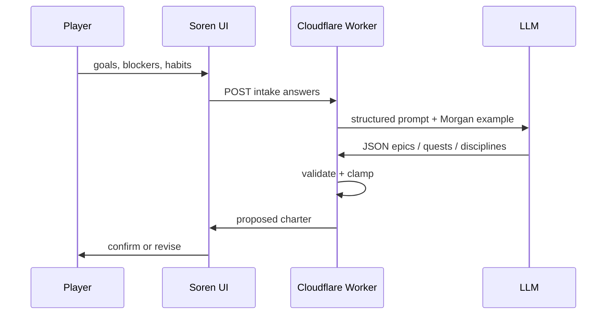

# QuestLife — Soren Intake Analysis (LLM)

> **Status:** Spec only — not yet implemented.  
> **Purpose:** Replace heuristic intake parsing with reliable interpretation of player goals, blockers, and habits — producing a good starter set of Epics, Quests, and Disciplines for confirmation.  
> **Related:** [`onboarding.md`](./onboarding.md) (progressive reveal after seeding), [`MentorConversation.tsx`](../src/components/onboarding/MentorConversation.tsx), [`intakeAnalysis.ts`](../src/domain/intakeAnalysis.ts) (current fallback).

---

## Problem

The current analyzer (`src/domain/intakeAnalysis.ts`) uses **text splitting and keyword heuristics**:

- Splits on commas, `and`, and newlines — breaks conversational answers
- Guesses epic vs quest from length and keywords (`career`, `promotion`, etc.)
- Turns blockers into generic quests (`Address: perfectionism`)
- Cannot infer actionable quests from vague goals (`feel less anxious about money`)
- Cannot link quests to epics intelligently

This is adequate for list-like input. It is not adequate for natural-language intake.

---

## Recommended approach

**Server-side LLM with structured JSON output + deterministic validation in app code.**

The LLM interprets free text. The app owns game rules (difficulty → XP/scale, categories, epic linking, assignment limits, id generation).

```text
Player answers (client)
  → POST /api/analyze-intake (Cloudflare Worker)
  → LLM returns strict JSON
  → Zod validate + clamp + dedupe
  → map to IntakeRatedItem[]
  → buildStarterPack() (existing)
  → review screen (existing)
  → player confirms → createCharacterFromIntake()
```



---

## What stays the same

| Piece | Location | Role |
|-------|----------|------|
| Soren Q&A flow | `MentorConversation.tsx` | Collect goals, name, blockers, daily habits |
| Review & confirm | `MentorConversation.tsx` | Player approves before character creation |
| Starter pack build | `buildStarterPack()` in `intake.ts` | Turn rated items → domain objects + assignments |
| Difficulty mapping | `difficulty.ts` | Difficulty → scale, XP, unlock level, discipline rewards |
| Category inference | `inferCategory()` in `intake.ts` | Keyword fallback; LLM may supply category directly |

---

## What changes

| Piece | Current | Future |
|-------|---------|--------|
| Analysis | `analyzeIntake()` heuristics (client, sync) | `POST /api/analyze-intake` (async) |
| Analysis location | `src/domain/intakeAnalysis.ts` | Worker handler + shared schema/types |
| Fallback | N/A | Keep `analyzeIntake()` when API fails or offline |
| Review screen | Read-only list | Optional: edit / remove / regenerate (phase 2) |

---

## API contract

### Request

```typescript
interface AnalyzeIntakeRequest {
  playerName: string;
  goals: string;       // IntakeProfile.northStar
  blockers: string;
  dailyHabits: string;
}
```

**Do not send:** owner private board data, existing quest catalogs, or localStorage registry contents. Only the four intake fields above.

### Response

```typescript
import type { Category } from "../src/domain/quest.ts";
import type { Difficulty } from "../src/domain/difficulty.ts";

interface AnalyzeIntakeResponse {
  epics: Array<{
    title: string;
    difficulty: Difficulty;
    rationale?: string; // for debugging / optional UI; not persisted
  }>;
  quests: Array<{
    title: string;
    difficulty: Difficulty;
    epicTitle?: string;  // must match an epic title in the same response
    category?: Category; // optional; inferCategory() used if omitted
  }>;
  disciplines: Array<{
    title: string;
    difficulty: Difficulty;
  }>;
}
```

### Limits (enforced in Worker after LLM, before response)

| Type | Min | Max | Notes |
|------|-----|-----|-------|
| Epics | 0 | 4 | Multi-month themes |
| Quests | 2 | 8 | Completable in days/weeks; verb-first |
| Disciplines | 1 | 5 | Daily or weekly habits only |

Additional validation:

- Dedupe by normalized title (case-insensitive)
- Title length caps (epic ≤ 56, quest ≤ 72, discipline ≤ 48 — match current UI)
- Quest `epicTitle` must reference an epic in the same payload (or drop the link)
- Strip empty strings; reject malformed difficulty/category enums
- Optional: quest titles should start with a verb (regex); retry or flag if not

---

## Prompt design

### System role

Soren is a mentor who turns a player's goals, blockers, and habits into a starter RPG charter: Epics (campaigns), Quests (near-term actions), Disciplines (daily keep).

### Few-shot anchor

Include **Morgan's tutorial pack** (`src/data/tutorialCharacter.ts`) as the quality bar:

- Epics: named campaigns with clear themes (`Get Promoted`, `Keep Shooting`)
- Quests: specific, verb-first, completable soon (`Ask your manager what's required for promotion`)
- Disciplines: daily rituals (`Morning walk`, `Read for 10 minutes`)

The model should mimic **structure and specificity**, not copy Morgan's content for new players.

### Generation rules (instruct the model explicitly)

**Epics**

- 0–4 items
- Multi-month life themes derived from goals
- Short titles (≤ 6 words where possible)

**Quests**

- 2–8 items
- Derived from **goals** (concrete next steps) and **blockers** (unblock actions — do not paste blocker text verbatim as the quest title)
- Verb-first, specific, completable within days or weeks
- Assign `epicTitle` when a quest clearly belongs to one epic
- Prefer `minor` difficulty (light/moderate) for first-week quests

**Disciplines**

- 1–5 items
- Only habits the player mentioned or clearly implied
- Do not invent habits the player did not describe

**General**

- Do not diagnose or give life advice — only produce game objects
- If input is vague, produce reasonable starter items rather than refusing

### Optional two-step reasoning (single API call)

Instruct the model to reason internally in two steps (not returned to client):

1. Extract themes: goals, blockers, stated/desired habits
2. Generate epics, quests, disciplines from those themes

---

## Architecture

| Layer | Recommendation |
|-------|----------------|
| Client | `MentorConversation` calls API after habits step; show existing "analyzing" beat with async wait |
| Server | Cloudflare Worker — **API keys never in Vite bundle** |
| Model | Small fast model with structured output (e.g. Claude Haiku, GPT-4o-mini) |
| Schema | JSON Schema or tool/function calling; parse with Zod on Worker |
| Fallback | On timeout / 4xx / 5xx / invalid JSON → `analyzeIntake()` heuristics |
| Caching | None for v1 (each character is unique) |

### Environment variables (Worker)

| Variable | Purpose |
|----------|---------|
| `LLM_API_KEY` | Provider API key |
| `LLM_MODEL` | Model id |
| `LLM_PROVIDER` | `openai` \| `anthropic` (or direct base URL) |

Owner local dev can hit the same deployed Worker, or a local Wrangler dev server with keys in `.dev.vars` (gitignored).

---

## Privacy & security

- **Public demo:** Intake text is new user input — safe to send to LLM for analysis. No Jamieson private data in the request.
- **Owner mode:** Same — only the new character's intake answers are sent. Existing owner quest/epic data stays in `private/` and localStorage; never included in the API payload.
- **Public bundle audit:** Ensure no API keys, no owner strings, no LLM prompts with private data ship in `dist/`.
- **Rate limiting:** Basic per-IP or per-session limit on Worker to prevent abuse.

---

## Client integration sketch

```typescript
// src/domain/analyzeIntakeRemote.ts (future)

export async function analyzeIntakeRemote(input: {
  playerName: string;
  northStar: string;
  blockers: string;
  dailyHabits: string;
}): Promise<Pick<IntakeProfile, "epics" | "quests" | "disciplines">> {
  try {
    const res = await fetch("/api/analyze-intake", {
      method: "POST",
      headers: { "Content-Type": "application/json" },
      body: JSON.stringify({
        playerName: input.playerName,
        goals: input.northStar,
        blockers: input.blockers,
        dailyHabits: input.dailyHabits,
      }),
    });
    if (!res.ok) throw new Error(`analyze-intake ${res.status}`);
    const data = AnalyzeIntakeResponseSchema.parse(await res.json());
    return mapResponseToIntakeItems(data);
  } catch {
    return analyzeIntake(input); // existing heuristic fallback
  }
}
```

Replace the synchronous `analyzeIntake()` call in `MentorConversation.tsx` (analyze step `useEffect`) with this async function.

---

## Rollout phases

### Phase 1 — MVP

- [ ] Worker route `POST /api/analyze-intake`
- [ ] Zod schema + validation + limits
- [ ] Prompt with Morgan few-shot
- [ ] Client async call + loading state during analyze step
- [ ] Heuristic fallback on failure

### Phase 2 — Review UX

- [ ] Edit / remove items on review screen before confirm
- [ ] "Regenerate" with optional feedback ("too vague", "more health quests")

### Phase 3 — Quality loop

- [ ] Eval harness: 10–15 golden intake examples (Morgan + synthetic personas)
- [ ] Run evals on prompt changes in CI or manual script
- [ ] Log anonymized failure cases (malformed JSON, validation rejects)

### Phase 4 — Optional enhancements

- [ ] Clarifying question from Soren when goals are very short (< N chars)
- [ ] Category always from LLM (retire or reduce `inferCategory()` keyword reliance)
- [ ] Regenerate single section (epics only, quests only, etc.)

---

## Alternatives considered

| Approach | Verdict |
|----------|---------|
| More regex / rules in `intakeAnalysis.ts` | Cheap and offline, but won't feel intelligent. **Keep as fallback only.** |
| Embeddings + template library | Fast; matches goals to pre-written quest packs. Rigid for novel goals. |
| Full multi-turn agentic Soren | Overkill for v1; slower, costlier, harder to test. Defer to coaching features. |
| Client-side LLM (WebLLM) | Privacy-friendly but heavy and inconsistent on mobile. Not recommended yet. |
| **Structured LLM + validation** | **Recommended** — best quality/cost/speed fit for current flow. |

---

## Files to touch (when implementing)

| File | Change |
|------|--------|
| `functions/api/analyze-intake.ts` or Worker handler | New — LLM call + validation |
| `src/domain/analyzeIntakeRemote.ts` | New — client fetch + fallback |
| `src/domain/intakeAnalysis.ts` | Keep — rename or comment as fallback |
| `src/components/onboarding/MentorConversation.tsx` | Async analyze step |
| `wrangler.jsonc` | Route binding, secrets |
| `scripts/eval-intake-analysis.mjs` | New (phase 3) — golden tests |

---

## Success criteria

- Player describes goals in natural prose (not a list) → receives 2+ specific, verb-first quests linked to sensible epics
- Blockers produce unblock quests, not copy-pasted blocker labels
- Habits become disciplines; no invented habits
- Review screen shows a charter comparable in quality to Morgan's starter pack
- Public deploy: no API keys or private owner data in bundle
- API failure degrades gracefully to heuristic fallback without blocking character creation
